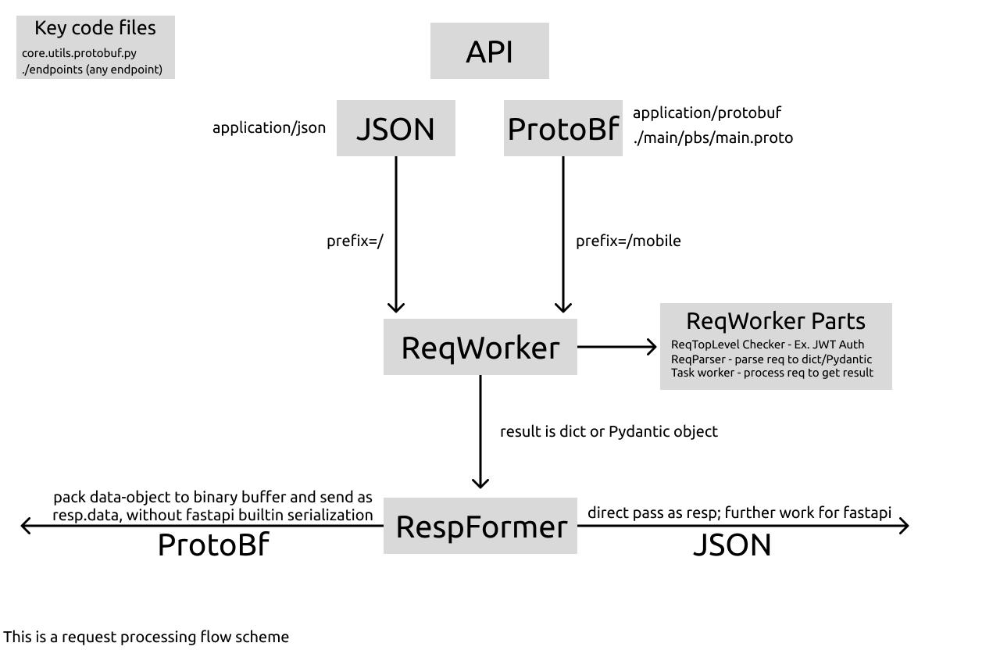

# API docs
[🇬🇧 English](/README.MD) [🇷🇺 Russian](/README.RU.MD)
## Table of contents
1. [ General ](#general) 
2. [ Handling requests ](#req_handling) 
3. [ Deployment ](#deployment) 
4. [ Testing all API ](#tests)

## General

This is a repository with a ShTP backend. To demonstrate and interact with the API, you can use swagger by building the repository locally (/docs).
 
Tech-Stack

1. FastAPI + ASGI, so <b>fully async app</b>
2. Postgresql
3. sqlalchemy(async driver) for ORM
4. Alembic
5. Pydantic
6. Protobuf(Proto3)
7. jose - JWT Auth
8. Self-written API test system(to support protobuffers)
9. Docker + Docker compose
10. Pipenv

## How we Handle HTTP Requests

Our API supports 2 types of data serialization: JSON(we use in our React client) and ProtocolBuffer(we use in our Java Android client).

The use of protocol buffers can significantly speed up the work of a mobile application due to efficient binary serialization. And the main difficulty in implementing the buffer protocol is the beauty of the architecture of the final application.

So, we have a routing that accepts an input as a pydantic object or a json, it is convenient to work with it, there is no need to worry about parsing inputs from the request. Routing returns a pythonic dictionary or also a pydantic object, which in our case is the same. In our project, everything is simple - there is a wrapper above the usual json routings, which converts the received input from the protobuffers into the one necessary for the endpoint and similarly works on the result of the endpoint, converting it into a protobuffer. More detailed diagram in the image below.

## Why self-written tests?!?!?!

Why did we invent the wheel and write a system for api test from scratch?

The main problem is support for protobuffers. We don't use them in the context of grpc, we use them as a separate tool for serializing packages. It makes no sense to get into the code of ready-made autotests - it is very long and inconvenient. It's faster to write your own test system and not fool around.

